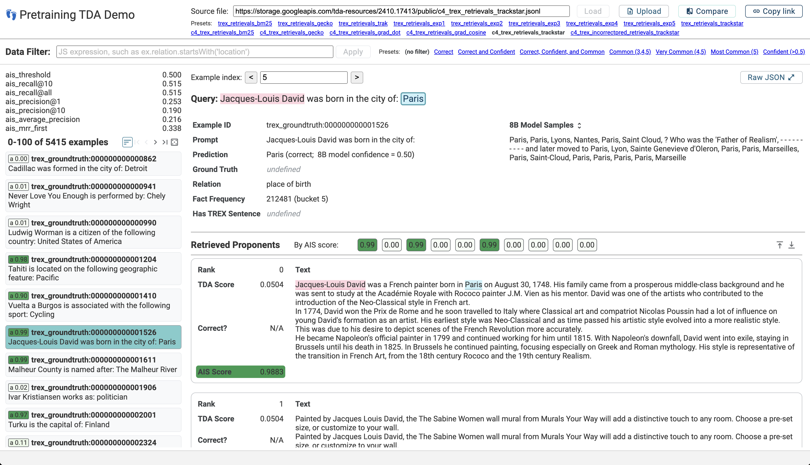

# Scalable Influence and Fact Tracing for Large Language Model Pretraining

This is the landing page for the code and data release accompanying
[Scalable Influence and Fact Tracing for Large Language Model Pretraining][tda-paper]
(Chang et al. 2024).

Specifically, this includes:

*   [Data files](./#data-files) in JSON lines (`.jsonl`) format for:
    *   The set of 5.4k prompts (queries) used for fact tracing evaluation, as
        well as the full set of 1.2M queries these are sampled from.
    *   TDA method outputs (retrieved and scored proponents) corresponding to
        the experiments in Section 5 and Section 6 of the paper.
    *   TDA method outputs corresponding to additional evaluation tasks in
        Appendix A.5 of the paper.
    *   The corpus of 19.6M sentences from T-REx Wikipedia abstracts (Section
        4.2 and 5 of the paper).
*   [A data viewer app](demo/) to make it easier to look at and analyze sets of
    retrieved proponents.

## TDA Output Viewer

Lists of proponent passages are challenging to work with in spreadsheets or
plain text files, due to the amount of text on-screen and the difficulty of
quickly looking at scores, identifying string matches, or filtering to specific
types of examples. We found it useful to write custom HTML visualizations, and
packaged these into a simple viewer app:

https://pair-code.github.io/pretraining-tda/demo



You can load a `.jsonl` file of TDA results (a set of test examples and their
retrieved proponents from the training set) from a URL or by uploading from your
computer; [see below](#tda-method-results) for links to load the experiments
from the paper. The app runs entirely in-browser and doesn't send your data to
any server. For more information, see
[the user guide and app documentation](demo/).

## Data files

### Evaluation queries

The set of 5.4k triples and associated prompts (factual queries) used in the
experiments in the paper:
https://storage.googleapis.com/tda-resources/2410.17413/public/trex_facts_sample.jsonl

The full set of 1.2M triples which these are sampled from:
https://storage.googleapis.com/tda-resources/2410.17413/public/trex_facts.jsonl
(1GB file). Note that the set of 5.4k is **not** sampled uniformly from this;
see Section 4.2 of the paper for more details.

Each record has the following fields:

*   `fact_id`
*   `kilt_id`
*   `entity0`, `relation`, and `entity1`
*   `entity0_uri`, `predicate_uri`, and `entity1_uri`
*   `entity0_alias` and `entity1_alias` - alternative surface forms
*   `trex_sentences`- mapping to the [T-REx sentences](#t-rex-sentences), below
*   `c4_frequency` - annotation, based on string matching, of how frequently
    this fact appears in the C4 pretraining corpus
*   `is_repetition` - if the fact contains repetition between entity0 and
    entity1
*   `prompt0`, `prompt1`, `prompt2` - input prompts for this fact, generated
    using different templates. Unless otherwise specified, we use `prompt0` for
    experiments in the paper.

### TDA method results

The results files as used in the main paper are linked in the tables below. Each
record has the following fields:

*   `example_id`
*   `query_set`
*   `inputs_plaintext` - the prompt (query) string; for T-REx facts, this is
    `prompt0` from the query files above
*   `targets_plaintext` - the target string, generally `entity1` from the query
    files above
*   `proponents` (as `string[]`) - proponent passage text
*   `proponent_ids` (as `string[]`) - passage IDs (for T-REx or C4)
*   `proponent_scores` (as `number[]`) - passage scores from the TDA method
    (e.g. Equation (1) of the paper)

For TDA methods that support a notion of "opponents" (this includes most
gradient-based methods, but not the BM25 or Gecko baselines) we also include
fields analogous to the proponents:

*   `opponents` (as `string[]`)
*   `opponent_ids` (as `string[]`)
*   `opponent_scores` (as `number[]`)

And for T-REx records in Tables 1 and 2 (some fields marked optional):

*   `fact_id`
*   `relation`
*   `8b_generations` (as `string[]`) - decoder samples from the 8B model, for
    estimating confidence in the LLM's answer
*   `8b_confidence` (as `number`) - fraction of samples from the 8B that match
    the target entity or an alias
*   `c4_frequency` and `c4_frequency_bucket` - frequency of the fact in the C4
    corpus, based on string matching. Bucket groups this into 0, 1, 2, 3, 4, 5,
    with 5 containing the most common facts.
*   `has_trex_sentence` - for retrievals from T-REx sentences, if there exists
    any sentence in T-REx containing this fact (optional, only Table 1)
*   `proponent_correct` (as `boolean[]`) - for retrievals from T-REx sentences,
    whether each proponent contains the fact, according to the T-REx annotations
    (optional, only Table 1)
*   `proponent_ais_scores` (as `number[]`) - for retrievals from C4, scores from
    the AIS (entailment) model for each proponent (optional, only Table 2)

For all tasks outside of T-REx, we retrieve proponents using TrackStar with the
non-task-specific Hessian approximation (see Appendix A.5 in the paper). The
additional tasks have the following optional fields:

*   `is_8b_correct` - for T-REx and arithmetic tasks, whether the 8B model
    generation matches the ground truth; for PIQA and COPA, whether the 8B model
    assigns higher probability to the ground truth than to the alternative
    completion; for story generation, this field is not included (no "ground
    truth" to compare to).
*   `groundtruth` - for T-REx incorrect predictions, the ground-truth target
    (entity); otherwise, this is omitted and `targets_plaintext` is equal to the
    ground truth answer.

**Table 1: T-REx facts, retrievals from T-REx sentences**

Method    | Download .jsonl file                                                                                                              | Viewer link
--------- | --------------------------------------------------------------------------------------------------------------------------------- | -----------
BM25      | [trex_retrievals_bm25.jsonl](https://storage.googleapis.com/tda-resources/2410.17413/public/trex_retrievals_bm25.jsonl)           | [view in app](https://pair-code.github.io/pretraining-tda/demo/?jsonl_path=%5Btrex_retrievals_bm25.jsonl%5D%28https%3A%2F%2Fstorage.googleapis.com%2Ftda-resources%2F2410.17413%2Fpublic%2Ftrex_retrievals_bm25.jsonl%29)
Gecko     | [trex_retrievals_gecko.jsonl](https://storage.googleapis.com/tda-resources/2410.17413/public/trex_retrievals_gecko.jsonl)         | [view in app](https://pair-code.github.io/pretraining-tda/demo/?jsonl_path=%5Btrex_retrievals_gecko.jsonl%5D%28https%3A%2F%2Fstorage.googleapis.com%2Ftda-resources%2F2410.17413%2Fpublic%2Ftrex_retrievals_gecko.jsonl%29)
TRAK      | [trex_retrievals_trak.jsonl](https://storage.googleapis.com/tda-resources/2410.17413/public/trex_retrievals_trak.jsonl)           | [view in app](https://pair-code.github.io/pretraining-tda/demo/?jsonl_path=%5Btrex_retrievals_trak.jsonl%5D%28https%3A%2F%2Fstorage.googleapis.com%2Ftda-resources%2F2410.17413%2Fpublic%2Ftrex_retrievals_trak.jsonl%29)
Exp 1     | [trex_retrievals_exp1.jsonl](https://storage.googleapis.com/tda-resources/2410.17413/public/trex_retrievals_exp1.jsonl)           | [view in app](https://pair-code.github.io/pretraining-tda/demo/?jsonl_path=%5Btrex_retrievals_exp1.jsonl%5D%28https%3A%2F%2Fstorage.googleapis.com%2Ftda-resources%2F2410.17413%2Fpublic%2Ftrex_retrievals_exp1.jsonl%29)
Exp 2     | [trex_retrievals_exp2.jsonl](https://storage.googleapis.com/tda-resources/2410.17413/public/trex_retrievals_exp2.jsonl)           | [view in app](https://pair-code.github.io/pretraining-tda/demo/?jsonl_path=%5Btrex_retrievals_exp2.jsonl%5D%28https%3A%2F%2Fstorage.googleapis.com%2Ftda-resources%2F2410.17413%2Fpublic%2Ftrex_retrievals_exp2.jsonl%29)
Exp 3     | [trex_retrievals_exp3.jsonl](https://storage.googleapis.com/tda-resources/2410.17413/public/trex_retrievals_exp3.jsonl)           | [view in app](https://pair-code.github.io/pretraining-tda/demo/?jsonl_path=%5Btrex_retrievals_exp3.jsonl%5D%28https%3A%2F%2Fstorage.googleapis.com%2Ftda-resources%2F2410.17413%2Fpublic%2Ftrex_retrievals_exp3.jsonl%29)
Exp 4     | [trex_retrievals_exp4.jsonl](https://storage.googleapis.com/tda-resources/2410.17413/public/trex_retrievals_exp4.jsonl)           | [view in app](https://pair-code.github.io/pretraining-tda/demo/?jsonl_path=%5Btrex_retrievals_exp4.jsonl%5D%28https%3A%2F%2Fstorage.googleapis.com%2Ftda-resources%2F2410.17413%2Fpublic%2Ftrex_retrievals_exp4.jsonl%29)
Exp 5     | [trex_retrievals_exp5.jsonl](https://storage.googleapis.com/tda-resources/2410.17413/public/trex_retrievals_exp5.jsonl)           | [view in app](https://pair-code.github.io/pretraining-tda/demo/?jsonl_path=%5Btrex_retrievals_exp5.jsonl%5D%28https%3A%2F%2Fstorage.googleapis.com%2Ftda-resources%2F2410.17413%2Fpublic%2Ftrex_retrievals_exp5.jsonl%29)
TrackStar | [trex_retrievals_trackstar.jsonl](https://storage.googleapis.com/tda-resources/2410.17413/public/trex_retrievals_trackstar.jsonl) | [view in app](https://pair-code.github.io/pretraining-tda/demo/?jsonl_path=%5Btrex_retrievals_trackstar.jsonl%5D%28https%3A%2F%2Fstorage.googleapis.com%2Ftda-resources%2F2410.17413%2Fpublic%2Ftrex_retrievals_trackstar.jsonl%29)

**Table 2: T-REx facts, retrievals from C4**

Method               | Download .jsonl file                                                                                                                        | Viewer link
-------------------- | ------------------------------------------------------------------------------------------------------------------------------------------- | -----------
BM25                 | [c4_trex_retrievals_bm25.jsonl](https://storage.googleapis.com/tda-resources/2410.17413/public/c4_trex_retrievals_bm25.jsonl)               | [view in app](https://pair-code.github.io/pretraining-tda/demo/?jsonl_path=%5Bc4_trex_retrievals_bm25.jsonl%5D%28https%3A%2F%2Fstorage.googleapis.com%2Ftda-resources%2F2410.17413%2Fpublic%2Fc4_trex_retrievals_bm25.jsonl%29)
Gecko                | [c4_trex_retrievals_gecko.jsonl](https://storage.googleapis.com/tda-resources/2410.17413/public/c4_trex_retrievals_gecko.jsonl)             | [view in app](https://pair-code.github.io/pretraining-tda/demo/?jsonl_path=%5Bc4_trex_retrievals_gecko.jsonl%5D%28https%3A%2F%2Fstorage.googleapis.com%2Ftda-resources%2F2410.17413%2Fpublic%2Fc4_trex_retrievals_gecko.jsonl%29)
Gradient dot product | [c4_trex_retrievals_grad_dot.jsonl](https://storage.googleapis.com/tda-resources/2410.17413/public/c4_trex_retrievals_grad_dot.jsonl)       | [view in app](https://pair-code.github.io/pretraining-tda/demo/?jsonl_path=%5Bc4_trex_retrievals_grad_dot.jsonl%5D%28https%3A%2F%2Fstorage.googleapis.com%2Ftda-resources%2F2410.17413%2Fpublic%2Fc4_trex_retrievals_grad_dot.jsonl%29)
Gradient cosine      | [c4_trex_retrievals_grad_cosine.jsonl](https://storage.googleapis.com/tda-resources/2410.17413/public/c4_trex_retrievals_grad_cosine.jsonl) | [view in app](https://pair-code.github.io/pretraining-tda/demo/?jsonl_path=%5Bc4_trex_retrievals_grad_cosine.jsonl%5D%28https%3A%2F%2Fstorage.googleapis.com%2Ftda-resources%2F2410.17413%2Fpublic%2Fc4_trex_retrievals_grad_cosine.jsonl%29)
TrackStar            | [c4_trex_retrievals_trackstar.jsonl](https://storage.googleapis.com/tda-resources/2410.17413/public/c4_trex_retrievals_trackstar.jsonl)     | [view in app](https://pair-code.github.io/pretraining-tda/demo/?jsonl_path=%5Bc4_trex_retrievals_trackstar.jsonl%5D%28https%3A%2F%2Fstorage.googleapis.com%2Ftda-resources%2F2410.17413%2Fpublic%2Fc4_trex_retrievals_trackstar.jsonl%29)

**Appendix A.5: Additional tasks, retrievals from C4**

Task                        | Download .jsonl file                                                                                                                                                                                      | Viewer link
--------------------------- | --------------------------------------------------------------------------------------------------------------------------------------------------------------------------------------------------------- | -----------
T-REx incorrect predictions | [c4_trex_incorrectpred_retrievals_trackstar.jsonl](https://storage.googleapis.com/tda-resources/2410.17413/public/c4_trex_incorrectpred_retrievals_trackstar.jsonl)                                       | [view in app](https://pair-code.github.io/pretraining-tda/demo/?jsonl_path=%5Bc4_trex_incorrectpred_retrievals_trackstar.jsonl%5D%28https%3A%2F%2Fstorage.googleapis.com%2Ftda-resources%2F2410.17413%2Fpublic%2Fc4_trex_incorrectpred_retrievals_trackstar.jsonl%29)
COPA                        | [c4_copa_retrievals_trackstar_nontaskspecific.jsonl](https://storage.googleapis.com/tda-resources/2410.17413/public/c4_copa_retrievals_trackstar_nontaskspecific.jsonl)                                   | [view in app](https://pair-code.github.io/pretraining-tda/demo/?jsonl_path=%5Bc4_copa_retrievals_trackstar_nontaskspecific.jsonl%5D%28https%3A%2F%2Fstorage.googleapis.com%2Ftda-resources%2F2410.17413%2Fpublic%2Fc4_copa_retrievals_trackstar_nontaskspecific.jsonl%29)
PIQA                        | [c4_piqa_retrievals_trackstar_nontaskspecific.jsonl](https://storage.googleapis.com/tda-resources/2410.17413/public/c4_piqa_retrievals_trackstar_nontaskspecific.jsonl)                                   | [view in app](https://pair-code.github.io/pretraining-tda/demo/?jsonl_path=%5Bc4_piqa_retrievals_trackstar_nontaskspecific.jsonl%5D%28https%3A%2F%2Fstorage.googleapis.com%2Ftda-resources%2F2410.17413%2Fpublic%2Fc4_piqa_retrievals_trackstar_nontaskspecific.jsonl%29)
Arithmetic word problems    | [c4_arithmeticwordproblem_retrievals_trackstar_nontaskspecific.jsonl](https://storage.googleapis.com/tda-resources/2410.17413/public/c4_arithmeticwordproblem_retrievals_trackstar_nontaskspecific.jsonl) | [view in app](https://pair-code.github.io/pretraining-tda/demo/?jsonl_path=%5Bc4_arithmeticwordproblem_retrievals_trackstar_nontaskspecific.jsonl%5D%28https%3A%2F%2Fstorage.googleapis.com%2Ftda-resources%2F2410.17413%2Fpublic%2Fc4_arithmeticwordproblem_retrievals_trackstar_nontaskspecific.jsonl%29)
Simple arithmetic           | [c4_arithmetic_retrievals_trackstar_nontaskspecific.jsonl](https://storage.googleapis.com/tda-resources/2410.17413/public/c4_arithmetic_retrievals_trackstar_nontaskspecific.jsonl)                       | [view in app](https://pair-code.github.io/pretraining-tda/demo/?jsonl_path=%5Bc4_arithmetic_retrievals_trackstar_nontaskspecific.jsonl%5D%28https%3A%2F%2Fstorage.googleapis.com%2Ftda-resources%2F2410.17413%2Fpublic%2Fc4_arithmetic_retrievals_trackstar_nontaskspecific.jsonl%29)
Story generation            | [c4_storygeneration_retrievals_trackstar_nontaskspecific.jsonl](https://storage.googleapis.com/tda-resources/2410.17413/public/c4_storygeneration_retrievals_trackstar_nontaskspecific.jsonl)             | [view in app](https://pair-code.github.io/pretraining-tda/demo/?jsonl_path=%5Bc4_storygeneration_retrievals_trackstar_nontaskspecific.jsonl%5D%28https%3A%2F%2Fstorage.googleapis.com%2Ftda-resources%2F2410.17413%2Fpublic%2Fc4_storygeneration_retrievals_trackstar_nontaskspecific.jsonl%29)

### T-REx sentences

This is the corpus of 19.6 M sentences as described in Section 4.2 and Section
5, and used for the experiments in Section 5 of the paper. The data is
approximately 6GB, split across 20 shards:

`https://storage.googleapis.com/tda-resources/2410.17413/public/trex_sentences.jsonl-000[XY]-of-00020`:

*   [00](https://storage.googleapis.com/tda-resources/2410.17413/public/trex_sentences.jsonl-00000-of-00020)
    [01](https://storage.googleapis.com/tda-resources/2410.17413/public/trex_sentences.jsonl-00001-of-00020)
    [02](https://storage.googleapis.com/tda-resources/2410.17413/public/trex_sentences.jsonl-00002-of-00020)
    [03](https://storage.googleapis.com/tda-resources/2410.17413/public/trex_sentences.jsonl-00003-of-00020)
    [04](https://storage.googleapis.com/tda-resources/2410.17413/public/trex_sentences.jsonl-00004-of-00020)
*   [05](https://storage.googleapis.com/tda-resources/2410.17413/public/trex_sentences.jsonl-00005-of-00020)
    [06](https://storage.googleapis.com/tda-resources/2410.17413/public/trex_sentences.jsonl-00006-of-00020)
    [07](https://storage.googleapis.com/tda-resources/2410.17413/public/trex_sentences.jsonl-00007-of-00020)
    [08](https://storage.googleapis.com/tda-resources/2410.17413/public/trex_sentences.jsonl-00008-of-00020)
    [09](https://storage.googleapis.com/tda-resources/2410.17413/public/trex_sentences.jsonl-00009-of-00020)
*   [10](https://storage.googleapis.com/tda-resources/2410.17413/public/trex_sentences.jsonl-00010-of-00020)
    [11](https://storage.googleapis.com/tda-resources/2410.17413/public/trex_sentences.jsonl-00011-of-00020)
    [12](https://storage.googleapis.com/tda-resources/2410.17413/public/trex_sentences.jsonl-00012-of-00020)
    [13](https://storage.googleapis.com/tda-resources/2410.17413/public/trex_sentences.jsonl-00013-of-00020)
    [14](https://storage.googleapis.com/tda-resources/2410.17413/public/trex_sentences.jsonl-00014-of-00020)
*   [15](https://storage.googleapis.com/tda-resources/2410.17413/public/trex_sentences.jsonl-00015-of-00020)
    [16](https://storage.googleapis.com/tda-resources/2410.17413/public/trex_sentences.jsonl-00016-of-00020)
    [17](https://storage.googleapis.com/tda-resources/2410.17413/public/trex_sentences.jsonl-00017-of-00020)
    [18](https://storage.googleapis.com/tda-resources/2410.17413/public/trex_sentences.jsonl-00018-of-00020)
    [19](https://storage.googleapis.com/tda-resources/2410.17413/public/trex_sentences.jsonl-00019-of-00020)

Or fetch all using [gsutil](https://cloud.google.com/storage/docs/gsutil):
`gsutil -m cp 'gs://tda-resources/2410.17413/public/trex_sentences.jsonl-*'
/path/to/local/dir`

Each record has the following fields:

*   `sentence_id`
*   `text`
*   `abstract_uri`
*   `sent_idx_in_abst` - index of this sentence in the original abstract
*   `fact_triples` - relevant fact triples which are found in this sentence

## Citing this work

If you use this data or find the data viewer useful, please cite our paper at:

```bibtex
@article{chang2024scalable,
  title={Scalable Influence and Fact Tracing for Large Language Model Pretraining},
  author={Chang, Tyler A. and Rajagopal, Dheeraj and Bolukbasi, Tolga and Dixon, Lucas and Tenney, Ian},
  journal={arXiv preprint arXiv:2410.17413},
  year={2024}
}
```

## License and disclaimer

Copyright 2024 DeepMind Technologies Limited All software is licensed under the
Apache License, Version 2.0 (Apache 2.0); you may not use this file except in
compliance with the Apache 2.0 license. You may obtain a copy of the Apache 2.0
license at: https://www.apache.org/licenses/LICENSE-2.0

All other materials, except as set out below, are licensed under the Creative
Commons Attribution 4.0 International License (CC-BY). You may obtain a copy of
the CC-BY license at: https://creativecommons.org/licenses/by/4.0/legalcode.
This dataset contains passages from:

*   [C4][c4], which are made available under the
    [ODC Attribution License](https://opendatacommons.org/licenses/by/1-0/). You
    may obtain a copy of the ODC Attribution License at:
    https://opendatacommons.org/licenses/by/1-0/.
*   [T-REX][trex], which are made available under the
    [CC-BY-SA-4.0 License](https://creativecommons.org/licenses/by-sa/4.0/deed.en).
    Page IDs for the corresponding Wikipedia articles are included in the data
    files. You may obtain a copy of the CC-BY-SA-4.0 License at:
    https://creativecommons.org/licenses/by-sa/4.0/deed.en
*   [COPA][copa], Copyright (c) 2010, University of Southern California, which
    are made available under the
    [BSD 2-Clause License](https://opensource.org/license/bsd-2-clause). You may
    obtain a copy of the BSD 2-Clause License at:
    https://opensource.org/license/bsd-2-clause.
*   [PIQA][piqa], which are made available under the
    [Academic Free License v3.0](https://opensource.org/license/afl-3-0-php).
    You may obtain a copy of the Academic Free License v3.0 at:
    https://opensource.org/license/afl-3-0-php.
*   [CogComp][cogcomp], Copyright (c) 2022 CogComp, which are made available
    under the [MIT License](https://opensource.org/license/mit). You may obtain
    a copy of the MIT License at: https://opensource.org/license/mit.

Unless required by applicable law or agreed to in writing, all software and
materials distributed here under the Apache 2.0 or CC-BY licenses are
distributed on an "AS IS" BASIS, WITHOUT WARRANTIES OR CONDITIONS OF ANY KIND,
either express or implied. See the licenses for the specific language governing
permissions and limitations under those licenses.

This is not an official Google product.

[c4]: https://www.tensorflow.org/datasets/catalog/c4
[cogcomp]: https://github.com/CogComp/arithmetic
[copa]: https://asgordon.github.io/copa.html
[piqa]: https://huggingface.co/datasets/ybisk/piqa
[tda-paper]: https://arxiv.org/abs/2410.17413
[trex]: https://hadyelsahar.github.io/t-rex/
