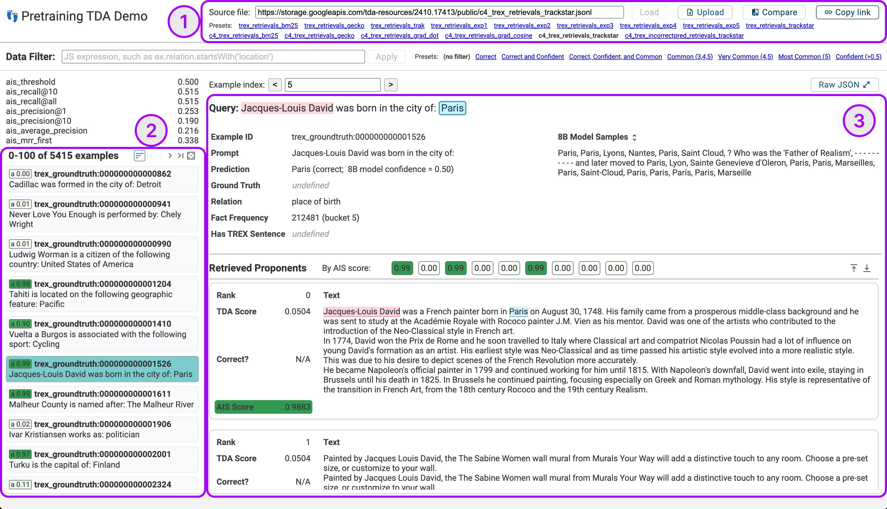
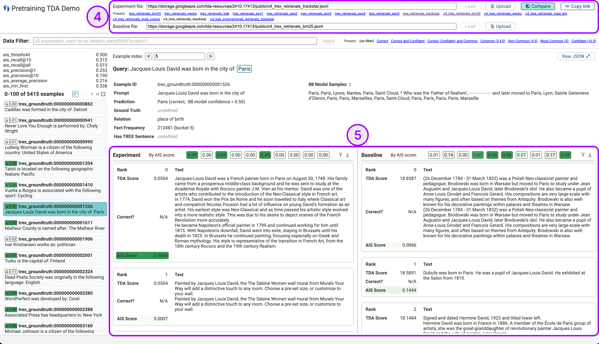

# TDA Output Viewer

Lists of proponent passages are challenging to work with in spreadsheets or
plain text files, due to the amount of text on-screen and the difficulty of
quickly looking at scores, identifying string matches, or filtering to specific
types of queries. We found it useful to write custom HTML visualizations, and
packaged these into a simple viewer app.

For any data in the
[.jsonl format for TDA method results](https://github.com/PAIR-code/pretraining-tda/blob/main/README.md#tda-method-results)
you can use our hosted instance as-is at
https://pair-code.github.io/pretraining-tda/demo. This runs entirely in the
browser and doesn't send data to any server.

## UI Guide



You can load (1) a `.jsonl` file from a URL (note: must allow
[CORS](https://en.wikipedia.org/wiki/Cross-origin_resource_sharing)), or by
uploading a local file. The app also includes presets corresponding to the
experiments from the paper. Note that it may take a few seconds to load,
depending on your connection speed.

The sidebar (2) on the left of the screen shows the available examples
(queries). Click one to view proponents, or use the pagination controls to see
more. If applicable, metrics are also shown above the example list.

You can also use the "Data Filter" bar to perform custom filtering using a
JavaScript expression. The variable `ex` represents the example record, and you
can use arbitrary logic like `ex.c4_frequency_bucket >= 3` or
`ex.inputs_plaintext.includes("Amsterdam")` to find matching examples.

The example view (3) shows the selected query and the retrieved proponents, as
well as additional metadata fields depending on the dataset. You can scroll to
see the different proponents, or click one of the chips ("By AIS Score:") to
jump to that one. In many cases it can be useful to see when strings from the
query appear in the proponent text: to highlight matches, click the target
string ("Paris" in the example above) or highlight part of the query text
("Jacques-Louis David").



The demo also supports a side-by-side (SxS) comparison mode to show retrievals
from two different runs on the same queries. Click the "Compare" button (4),
enter (or upload) a second `.jsonl` file to compare to, and click "Load". A
second column of proponents should appear in the example view (5).

## Customizing and running your own demo

For researchers building on this work or otherwise exploring TDA or similar
retrieval tasks, you may find it useful to modify this app - such as to add
additional fields, or to just update [presets.ts](./demo/presets.ts) with files
for your project. The easiest way to do this is to fork this repository, then
serve your own copy of the demo locally using [Node.js][nodejs], and [NPM][npm]:

```sh
# Clone the repo, replacing the default repo path as appropriate
git clone git@github.com:pair-code/pretraining-tda
cd pretraining-tda

# Install and build the website with Node.js
npm install
npm run website

# Serve the website locally
npm run serve
```

[nodejs]: https://nodejs.org/
[npm]: https://www.npmjs.com/
